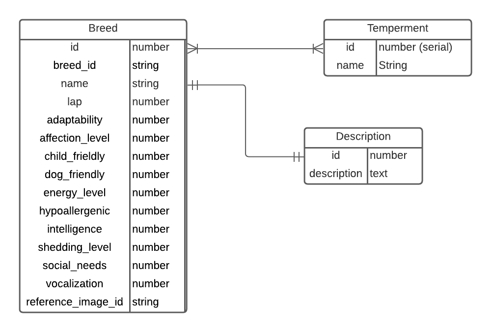
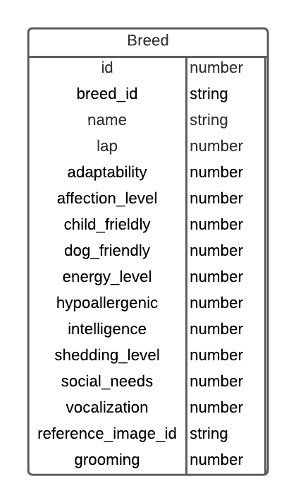

<h1>Cat Breed Chooser Backend</h1>

TABLE OF CONTENTES
- [Cat Breed Chooser Backend](#cat-breed-chooser-backend)
- [Installation Instructions](#installation-instructions)
  * [Dependencies](#dependencies)
  * [Run the Project](#run-the-project)
    + [Endpoints:](#endpoints-)
- [Technologies Used](#technologies-used)
- [Design](#design)
  * [ERD Diagrams](#erd-diagrams)
  * [Searching](#searching)
  * [Security](#security)
- [User Stories](#user-stories)
  * [MVP](#mvp)
  * [Future Goals](#future-goals)
- [Hurdles Overcome](#hurdles-overcome)
- [Unresolved Issues](#unresolved-issues)

# Cat Breed Chooser Backend

This project is the backend for the cat breed chooser app frontend available here: https://cat-breed-chooser.herokuapp.com.<br>

The purpose of this app is to supply data that originated from [thecatapi](https://thecatapi.com) to the frontend application. Using a backend rather the api directly allows the data processing to happen on a server rather than use the client resources.
<br><br>

# Installation Instructions

If you would like install this project on your computer rather than use the online version hosted at https://cat-breed-chooser-backend.herokuapp.com, you may clone this repository to your computer. (Also feel free to check out the frontend repository at https://github.com/richardcblewett/cat-breed-chooser)

After cloning the repository, make sure you have the dependencies installed before following the instructions on how to run the project.

## Dependencies

- An IDE that can interface with springboot (such as VSCode or IntelliJ IDEA)
- Git (https://git.scm.com/downloads)
- PostgresSQL (https://www.postgresql.org/download/)

## Run the Project

- Open the cloned project with the IDE.
- Check the configuration settings in ```src/main/resources/application-dev.properties``` and make sure the postgres settings match your own.
  <br><br>

### Endpoints:

| Request Type | URL           | Request Body                                   | Request Header      | Action                                                                            | Access |   
|--------------|---------------|------------------------------------------------|---------------------|-----------------------------------------------------------------------------------|--------|
| GET          | /api/breeds   |                                                | Authorization: none | returns a list of all breeds (not used in the frontend)                           | PUBLIC |
| GET          | /api/pictures |                                                | Authorization: none | returns image references and breed ids                                            | PUBLIC |
| GET          | /api/names    |                                                | Authorization: none | returns breed names and breed ids                                                 | PUBLIC |
| GET          | /api/id       |                                                | Authorization: none | updates an existing movie                                                         | PUBLIC |
| GET          | /api/search   | child_friendly <br> intelligence <br> grooming | Authorization: none | finds breeds that meet the criteria                                               | PUBLIC |
| GET          | /breeds       |                                                | Authorization: none | gets all breeds from thecatapi in order to seed the database (hidden by security) | PUBLIC |

<br><br>

# Technologies Used

- Git
- Lucid.app (ERD design)
- PostGreSQL
- Postman
- VS Code (IDE)
- IntelliJ IDEA (IDE)
  <br><br>

# Design

My original design for the backend was to have a database table for basic cat breed characteristics, another database table for the breed description in order to not overwhelm the first table, and then to have a third table to store some keywords associated with breeds. (This last item was to be an implementation option after achieving MVP.)<br>

Seeding the database was accomplished by opening an api endpoint (by removing security) that would immediately call thecatapi and adding the results of the "give me all thecatapi breeds" call to the database. Results from the external api call were added to the database as long as the breed had a name, had a photo, and the photo was accessible to the backend.<br>

After deploying the backend, I realized I have no idea if the database performance would be improved by giving breed descriptions their own database, so I pivoted from my original ERD designs and refactored the databases from 2 down to 1.<br>

## ERD Diagrams

| Original                                                            | Final                                                          |    
|---------------------------------------------------------------------|----------------------------------------------------------------|    
|  |  |  

<br>

## Searching

Rather than create a new JPA Query for every specific combination of parameters, for the most part I chose to use one query that would return all breeds and then filter out the breeds that did not meet the input criteria. I chose to do things this way because some of my earlier query attempts were returning errors and this was another way to give me the results I was looking for.<br>

As the old adage goes: "There's more than one way to skin a cat." <br>

## Security

Spring security is included in the code, but not fully implemented. I chose to have everything ready in case there was time to implement user logins and user profiles - but there was not.
<br><br>

# User Stories

All user stories assume the user is interested in getting a new cat and wants to do some initial research about the different cat breeds available.

## MVP

[x] As a user, I want to be able to browse the different breeds of cat so that I can do some research on breeds I know and find out if they will be a good choice for me.   
[x] As a user who has children, I want to be able to search for cats that a good with children so I don't have to worry about cats and children not getting along.   
[x] As a user who values intelligence, I want to be able to search for cat breeds that are at or above a certain intelligence threshold.   
[x] As a user who likes clean animals, I want to be able to search cat breeds and exclude those breeds who are not up to my standards.

## Future Goals

- As a user, I want to be able to search for more cat breed characteristics.
    - _The backend database has more data that could be accessed - it is a matter of finding the time to expand the frontend query form and update the backend to return more data._
    - _There is always the option to return more data from the backend by default, but sending an entire database the frontend on a query defeats the purpose of having a backend._
- As a user, I want to be able to login to the site and keep track of the different cat breeds in which I am interested.
    - _Most of the backend code to allow this is already in place, but needs to be implemented._
    - _In order to correctly implement user accounts, I would want to use available authentication services such as Google Authenticator and other similar tools. I'd rather not track individual users personal information_
- As a user, I want to be able to search in my local area for specific breeds of cat that are available to adopt.
    - _Once user information is incorporated, this options may become a possibility. But it would be a ways down the road._
- As a user, I want to receive alerts when a cat of a specific breed is available to adopt in my area.
    - _Again, this would depend on having user and location area available. Maybe the equivalent of a pipe dream._
      <br><br>

# Hurdles Overcome

1. As mentioned previously, initial issues with getting data from the database led me to find a way to avoid the issue. I didn't want to risk the solution being to restructure the database rather than to restructure queries. (The specific issue was an inability to return a "Breed" object from a query.)
2. As a way to seed the database from the api one time without allowing a user to do the same, I created a separate branch that has access to the seeding endpoint. If the database ever needs to be reconstructed, only a person with access to the source code will be able to do that.
   <br><br>

# Unresolved Issues

1. As previously mentioned, the database access could be fine-tuned so JPA queries are used.
2. I don't feel great about having unused data tables for users, but the solution to that issue would be to either add functionality to the website or to decide not to do so. Right now we remain in limbo.
   <br><br>
